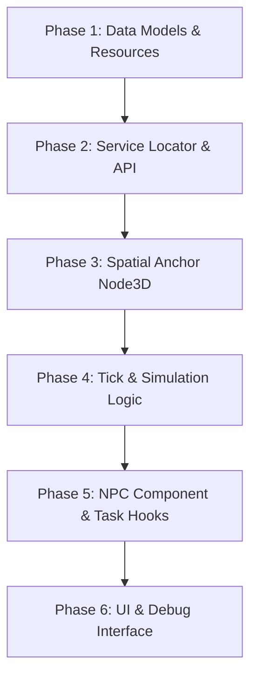

# Management Module Implementation Plan

This document outlines the step-by-step implementation plan for the **Management Module** in `feudal-game`. The implementation is divided into distinct, verifyable phases following the architectural mandates of the project's [GDD](file:///C:/Users/woodl/GitHub/gamedev-feudal/docs/design/management-module-gdd.md) and [TDD](file:///C:/Users/woodl/GitHub/gamedev-feudal/docs/design/management-module-tdd.md).

---

## Architecture Overview

The management module operates as a **headless data simulation** layer.
* Data structures reside in **Resources** for serialization support.
* Visual/spatial representation uses `ZoneAnchor3D` (Node3D/Area3D) to anchor data to the 3D Terrain.
* Subsystems discover the management layer dynamically via a global service locator autoload.

---

## Phase-by-Phase Plan

### Phase 1: Core Data Models (Resources & Constants)
Define all serialized resources and constant configurations to establish the module's data representation.

1. Create a directory structure for management resources under `src/feudal-age/scripts/resources/management/`.
2. Implement **[ZoneNode.gd](file:///C:/Users/woodl/GitHub/gamedev-feudal/src/feudal-age/scripts/resources/management/ZoneNode.gd)**:
   * Define `SettlementTier` enum: `WILDERNESS`, `CAMP`, `FARM`, `MANOR`, `VILLAGE`, `TOWN`.
   * Export properties: `node_id`, `node_name`, `current_tier`, `canopy_density`, base `fertilities` dictionary, `stockpile`, `allocated_construction_resources`, etc.
   * Add helper methods: `has_available_resources(requirements: Dictionary) -> bool`.
3. Implement **[BuildingData.gd](file:///C:/Users/woodl/GitHub/gamedev-feudal/src/feudal-age/scripts/resources/management/BuildingData.gd)**:
   * Holds static blueprint configuration: `building_id`, `display_name`, `build_cost`, `total_work_required`, `max_jobs`, and `job_type`.
4. Implement **[BuildingInstance.gd](file:///C:/Users/woodl/GitHub/gamedev-feudal/src/feudal-age/scripts/resources/management/BuildingInstance.gd)**:
   * Holds dynamic building state: `blueprint`, `is_completed`, `construction_progress`, `integrity`, and `assigned_worker_ids`.
5. Implement **[WorkerData.gd](file:///C:/Users/woodl/GitHub/gamedev-feudal/src/feudal-age/scripts/resources/management/WorkerData.gd)**:
   * Structural link between Populants and nodes: `character_id`, `qualification`.
6. Implement Constants in `src/feudal-age/scripts/management/`:
   * **[JobPriorities.gd](file:///C:/Users/woodl/GitHub/gamedev-feudal/src/feudal-age/scripts/management/JobPriorities.gd)**: Static constant array containing job execution weight hierarchy (`sustenance`, `builder`, `woodcutter`, `forager`).
   * **[DietPriorities.gd](file:///C:/Users/woodl/GitHub/gamedev-feudal/src/feudal-age/scripts/management/DietPriorities.gd)**: Static constant array representing consumption order (`Berries`, `Mushrooms`).

---

### Phase 2: Service Locator & API Layer
Enable global access and discovery for the management module using decoupled design patterns.

1. Implement **[ServiceLocator.gd](file:///C:/Users/woodl/GitHub/gamedev-feudal/src/feudal-age/scripts/autoloads/ServiceLocator.gd)**:
   * Create the global singleton script to register and fetch the `ManagementAPI` reference.
   * Add to Project Autoloads in `project.godot`.
2. Implement **[ManagementAPI.gd](file:///C:/Users/woodl/GitHub/gamedev-feudal/src/feudal-age/scripts/management/ManagementAPI.gd)**:
   * Autoload or main-scene node that registers itself to `ServiceLocator` on ready.
   * Track reference dictionary of `ZoneNode` resources.
   * Expose query API: `get_character_assignment()`, `get_node_canopy_density()`, `get_node_inspection_data()`.
   * Expose mutation/control API: `establish_camp()`, `order_building()`, `recruit_populant_to_faction()`, `assign_populant_to_node()`.
   * Add to Project Autoloads or scene instantiation hooks.
3. Update **[EventBus.gd](file:///C:/Users/woodl/GitHub/gamedev-feudal/src/feudal-age/scripts/autoloads/EventBus.gd)**:
   * Add `signal day_changed(new_day: int)` to decoupled event system.

---

### Phase 3: Spatial Anchors (`ZoneAnchor3D`)
Anchor the data resources in the physical 3D world to allow player selection and visualization.

1. Create **[ZoneAnchor3D.gd](file:///C:/Users/woodl/GitHub/gamedev-feudal/src/feudal-age/scripts/world/ZoneAnchor3D.gd)** and scene `ZoneAnchor3D.tscn`:
   * Extends `Area3D` for collision-based selection.
   * Holds an `@export` property for its corresponding `ZoneNode` data resource.
   * Create a selection mesh indicator (e.g., standard ring or polygon outline).
   * Implement toggle function `toggle_management_view(is_active: bool)` to enable/disable selection collision and visual overlays.
   * Add building instantiation logic: when building completion signal is received, spawn the visual representation (e.g., a static mesh or building prefab) at relative offsets.

---

### Phase 4: Tick-Based Simulation Logic
Write the core step functions inside `ZoneNode.gd` and trigger them from the main game loop.

1. In **[ZoneNode.gd](file:///C:/Users/woodl/GitHub/gamedev-feudal/src/feudal-age/scripts/resources/management/ZoneNode.gd)**, implement the step function `process_management_tick()`:
   * **Workforce Matching:** Match Populants (`local_workers`) with available job slots based on `JobPriorities`.
   * **Dietary Deduction:** Deduct food from the local stockpile according to `DietPriorities` based on resident count. Emit warning signals if starvation occurs.
   * **Construction Progress:** Spend builder labor points to advance queued buildings. Mark completed and update stockpiles.
   * **Production & Labor:** Run extraction logic (Woodcutter yields degrade `canopy_density`; Forager yields generate berries/mushrooms based on remaining canopy coverage).
   * **Storage Caps:** Enforce local node warehousing limits, discarding surplus if storage capacity is exceeded.
2. Track and emit daily ticks in **[GameManager.gd](file:///C:/Users/woodl/GitHub/gamedev-feudal/src/feudal-age/scripts/autoloads/GameManager.gd)**:
   * Introduce a `current_day` counter (int) and `day_timer` (float).
   * Define day duration (e.g., `day_duration: float = 15.0` seconds).
   * Tick the day timer in `_process(delta)`. When a day finishes, increment `current_day` and emit `EventBus.day_changed.emit(current_day)`.
3. Hook simulation tick to day changes:
   * Register a listener in `ManagementAPI` for `EventBus.day_changed`.
   * When received, loop through all registered `ZoneNode` data resources and call `process_management_tick()`.

---

### Phase 5: NPC Component & GOAP Integration
Integrate NPCs into the management module's labor allocation pipeline.

1. Create **[ManagementPopulantComponent.gd](file:///C:/Users/woodl/GitHub/gamedev-feudal/src/feudal-age/scripts/characters/components/ManagementPopulantComponent.gd)**:
   * Attach to the standard NPC character blueprint.
   * Define export properties: `character_id`, `serving_lord_id`, `assigned_node_id`, `qualification_profile`.
   * Store reference to `current_3d_workplace_target` (Marker3D).
2. Establish GOAP/behavior connection:
   * Add hooks in character controller to query `ManagementAPI.get_character_assignment()`.
   * Update GOAP brains to steer characters toward their designated spatial targets when their assigned job state is active.

---

### Phase 6: Management UI & Debug Controls
Create interactive overlays for the user to manage territories, assign workers, and build structures.

1. Create a simple floating inspection HUD inside `scenes/ui/`:
   * Displays when the mouse/reticle hovers over a `ZoneAnchor3D` node.
   * Shows core information: Node Name, Settlement Tier, Stocks (Timber, Berries, Mushrooms), and local worker count.
   * Renders as a compact, floating CanvasLayer UI panel at the projected screen position of the hovered node, or a clean screen-space HUD overlay.
2. Hook hover/raycast events from the player controller:
   * Keep track of currently hovered `ZoneAnchor3D` node.
   * Query `ManagementAPI.get_node_inspection_data(node_id)` on hover to populate the HUD fields.
   * Show/hide the floating HUD based on hover detection.

---

## Verification & Headless Testing Strategy

We will use headless checks to ensure code integrity and avoid run-time compilation issues:
* **Headless Integrity Check:**
  `godot --path ./src/feudal-age/ --headless --quit`
* Run-time verification tests can be created as minor unit test scripts executed via `--script`.
