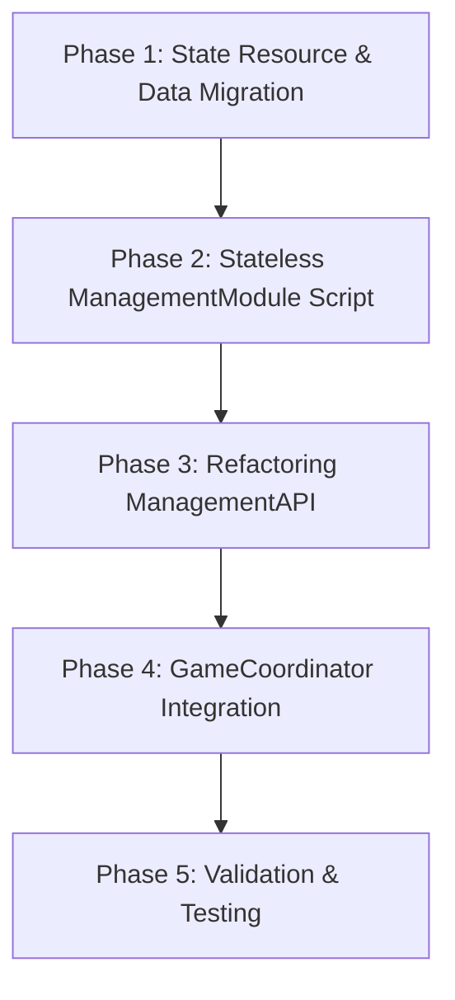

# Implementation Plan — New Management Module Integration

This document outlines the step-by-step implementation plan to align the **Management Module** in `feudal-game` with the stateless `GameModule` design pattern driven by the `GameCoordinator` (defined in the [TDD](file:///C:/Users/woodl/GitHub/gamedev-feudal/docs/design/management-module-tdd.md)).

```mermaid
graph TD
    Phase1["Phase 1: State Resource & Data Migration"] --> Phase2["Phase 2: Stateless ManagementModule Script"]
    Phase2 --> Phase3["Phase 3: Refactoring ManagementAPI"]
    Phase3 --> Phase4["Phase 4: GameCoordinator Integration"]
    Phase4 --> Phase5["Phase 5: Validation & Testing"]
```

---

## 1. Objective
Currently, the management simulation runs in a decentralized way: `ManagementAPI.gd` holds internal state (`_world_nodes`) and attempts to update it on a legacy event handler. 
We will shift this to:
1. Storing all state (including `_world_nodes`) in a central state resource (`FiefStateResource` or similar context resource).
2. Implementing a stateless `ManagementModule` node that implements the `GameModule` interface.
3. Having `GameCoordinator` pass the state context through `ManagementModule.process_tick(context)`.
4. Refactoring `ManagementAPI` to read directly from the coordinator's state container via the Service Locator.

---

## 2. Phase-by-Phase Plan

### Phase 1: State Resource & Data Migration
Set up the shared context container for simulation state.

1. **Define the Context Resource**:
   * Create `res://scripts/management/resources/FiefStateResource.gd` (or update existing global context scripts).
   * It must export a dictionary `world_nodes: Dictionary` (mapping `node_id: int -> ZoneNode`).
2. **Expose Context to GameCoordinator**:
   * Assign `FiefStateResource` as the `@export var game_context: Resource` on the `GameCoordinator` node in the inspector.

---

### Phase 2: Stateless `ManagementModule` Implementation
Create the worker node that performs simulation ticks.

1. **Create the Script**:
   * Create `res://scripts/management/management_module.gd` extending `Node`.
2. **Implement the `GameModule` Interface**:
   * `initialize_module() -> void`: Register initial configurations if necessary.
   * `process_tick(context: Resource) -> void`:
     * Assert `context` is a valid state resource.
     * Loop through every `node_id` in `context.world_nodes`.
     * Call `node.process_management_tick()` to execute workforce allocation, dietary deductions, construction progress, production, and storage capping.
   * `get_save_snapshot() -> Dictionary`:
     * Return any module-specific configuration variables that require persistence (e.g., global modifiers, simulation metrics).

---

### Phase 3: Refactoring `ManagementAPI`
Transition `ManagementAPI` from a state-holder into a transactional boundary interface.

1. **Remove Local State**:
   * Remove the local `_world_nodes` dictionary from `ManagementAPI.gd`.
2. **Reference the Coordinator**:
   * Add a reference to the active `GameCoordinator` or access the central `game_context` resource.
   * Query methods (e.g., `get_node_canopy_density()`, `get_node_inspection_data()`) must fetch the relevant `ZoneNode` from `game_coordinator.game_context.world_nodes[node_id]`.
3. **Refactor Mutation Commands**:
   * Command methods (e.g., `establish_camp()`, `order_building()`, `assign_populant_to_node()`) must mutate properties directly on the objects inside `game_coordinator.game_context`.
4. **Remove Tick Connections**:
   * Delete `_on_day_changed()` and the legacy event subscriptions, since simulation ticks will now be cleanly driven by `ManagementModule`.

---

### Phase 4: `GameCoordinator` Integration
Assemble the nodes in the active gameplay scene.

1. **Update `GameCoordinator` Scene**:
   * Open `res://scenes/gamecoordinator/GameCoordinator.tscn`.
   * Add `ManagementModule` as a child node.
   * Attach `res://scripts/management/management_module.gd`.
   * Ensure `module_init_order` exported array on `GameCoordinator` includes `"ManagementModule"`.
2. **API Alignment**:
   * Ensure `ManagementAPI` is present as a child node and registers itself with `ServiceLocator`.

---

### Phase 5: Verification & Testing
Verify system execution integrity.

1. **Headless Integrity Check**:
   * Run the project integration check to confirm compilation:
     `godot --path ./src/feudal-game/ --headless --quit`
2. **Console Tick Verification**:
   * Run the game and observe the console log output. Verify that `GC: Processing Day Ticks:` is printed periodically, and that the subroutines inside `ZoneNode.gd` are processing without errors.
